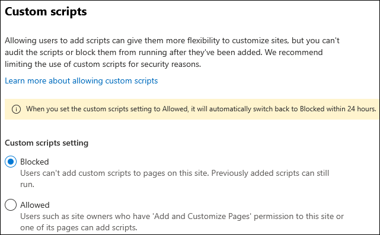

# Allow or prevent custom script

As a [SharePoint Administrator](./sharepoint-admin-role.md) in Microsoft 365, you can temporarily allow custom script as a way of letting users operate with some "classic" features (like "script editor web part"), change the look, feel, and behavior of sites and pages to meet organizational objectives or individual needs. If you allow custom script, all users who have _Add and Customize Pages_ permission to a site or page can add any script they want. (By default, users who create sites are site owners and therefore have this permission.) 
  
> [!NOTE]
> For simple ways to change the look and feel of a site, see [Change the look of your SharePoint site](https://support.office.com/article/06bbadc3-6b04-4a60-9d14-894f6a170818). 
  
By default, script isn't allowed on almost all sites that admins create using the SharePoint admin center and all sites created using the New-SPOSite PowerShell command. Same applies to OneDrive, sites users create themselves, modern team and communication sites, and the root site for your organization. For more info about the security implications of custom script, see [Security considerations of allowing custom script](security-considerations-of-allowing-custom-script.md).
  
> [!IMPORTANT]
> If SharePoint was set up for your organization before 2015, your custom script settings might still be set to _Not Configured_ even though in the SharePoint admin center they appear to be set to prevent users from running custom script. In this case, users can't copy items between SharePoint sites and between OneDrive and SharePoint. On the <a href="https://go.microsoft.com/fwlink/?linkid=2185072" target="_blank">Settings page in the SharePoint admin center</a>, to accept the custom script settings as they appear, select **OK**, and enable cross-site copying. For more info about copying items between OneDrive and SharePoint, see [Copy files and folders between OneDrive and SharePoint sites](https://support.office.com/article/67a6323e-7fd4-4254-99a8-35613492a82f). 
  
## To temporarily allow custom script on SharePoint sites

> [!CAUTION]
> Before you allow custom script on sites in your organization, make sure you understand the [security implications](security-considerations-of-allowing-custom-script.md). 
  
To allow custom script on a particular site (previously called _site collection_) immediately, follow these steps:

1. [Download the latest SharePoint Online Management Shell](https://go.microsoft.com/fwlink/p/?LinkId=255251).

    > [!NOTE]
    > If you installed a previous version of the SharePoint Online Management Shell, go to Add or remove programs and uninstall **SharePoint Online Management Shell**.

2. Connect to SharePoint as a [SharePoint Administrator](./sharepoint-admin-role.md) in Microsoft 365. To learn how, see [Getting started with SharePoint Online Management Shell](/powershell/sharepoint/sharepoint-online/connect-sharepoint-online).

3. Run the following command.

    ```PowerShell
    Set-SPOSite <SiteURL> -DenyAddAndCustomizePages 0
    ```
    or with the PnP.PowerShell cmdlet [Set-PnPSite](https://pnp.github.io/powershell/cmdlets/Set-PnPSite.html)
    
    ```PowerShell
    Set-PnPSite -Identity <SiteURL> -NoScriptSite $false
    ``` 

Changes to allow custom scripts are overridden to "Not allowed" within 24 hours.

> [!NOTE]
> Is not possible to allow custom scripts on an individual user's OneDrive.
  
## Manage custom script from SharePoint admin center

Tenants administrators have a set of tools available in SharePoint tenant administration to manage custom script within their organization. Specifically, tenant administrators can:

- verify custom script status 
- change custom script settings 
- persist custom script settings

### Verify custom script status

A new **Custom script** column is now available in the **Active sites** page under **Sites**.

:::image type="content" alt-text="Screenshot of active sites view with custom script column visible." source="media/232a2283-7f38-4f77-b32d-e076bbcbbb01.png" lightbox="media/232a2283-7f38-4f77-b32d-e076bbcbbb01.png":::

The column can be added to any view. A new **Custom script allowed sites** is also available to provide an easy access to all the sites where custom script is enabled:

:::image type="content" alt-text="Screenshot of the list of default views, which includes the 'custom script allowed sites' view." source="media/e19f29a8-601a-416a-b8fd-2f128461b52c.png":::

### Change custom script settings

In the **Active sites** page, select a site and under **Settings** > **Custom scripts**, you can edit whether custom scripts are allowed or blocked.

:::image type="content" alt-text="Screenshot of the 'Custom scripts' setting." source="media/7a9c6b79-db8b-4577-9a8c-978f011196a9.png":::

You can control custom script settings for a specific site; deciding if they want to allow or block custom script on a specific site:




By default, any changes to custom script settings for a specific site only last for a maximum of 24 hours. After that time, the setting resets to **Blocked** for that specific site.

> [!IMPORTANT]
> If the site is locked, either because it is in *ReadOnly* or *NoAccess" state, changes to the Custom Script settings won't be reflected in SharePoint Tenant Administration. However, as soon as the state of the site goes back to *Unlock*, Custom Script setting immediately turns to "Not allowed" before any user can access to the site  

## Features affected when custom script is blocked

When users are prevented from running custom script on OneDrive or the classic team sites they create, site admins and owners can't create new items such as templates, solutions, themes, and help file collections. If you allowed custom script in the past, items that were already created will still work.
  
The following site settings are unavailable when users are prevented from running custom script:

| Site feature | Behavior | Notes |
|:-----|:-----|:-----|
|Save Site as Template |No longer available in Site Settings |Users can still build sites from templates created before custom script was blocked. |
|Save document library as template |No longer available in Library Settings  |Users can still build document libraries from templates created before custom script was blocked.  |
|Save list as template  |	No longer available in List Settings  |Users can still build lists from templates created before custom script was blocked.  |
|Theme Gallery  |No longer available in Site Settings  |Users can still use themes created before custom script was blocked.  |
|Help Settings  |No longer available in Site Settings  |Users can still access help file collections available before custom script was blocked.  |
|Sandbox solutions  |Solution Gallery is no longer available in Site Settings  |Users can't add, manage, or upgrade sandbox solutions. They can still run sandbox solutions that were deployed before custom script was blocked.  |
|SharePoint Designer  |Pages that aren't HTML can no longer be updated.  <br/> Handling List: **Create Form** and **Custom Action** will no longer work.  <br/> Subsites: **New Subsite** and **Delete Site** redirect to the **Site Settings** page in the browser. <br/> Data Sources: **Properties** button is no longer available.  |Users can still open some data sources. To open a site that doesn't allow custom script in SharePoint Designer, you must first open a site that does allow custom script.  |
|Operating files that potentially include script|The following file types can't be uploaded, copied, moved or opened in a library.<br/> .asmx  <br/> .ascx  <br/> .aspx  <br/> .htc  <br/> .jar  <br/> .master  <br/> .swf  <br/> .xap  <br/> .xsf  |Existing files in the library aren't impacted.  |
|Uploading Documents to Content Types  |Access denied message when attempting to attach a document template to a Content Type. |We recommend using Document Library document templates. |
|Publishing of SharePoint 2010 Workflows |Access denied message when attempting to publish a SharePoint 2010 Workflow. | |
|Custom Actions|Access denied message when attempting to create new custom actions.|Existing custom actions aren't impacted.|
|Design Manager|Access denied message when attempting to create new layout, master page or design package.|Users can still use page designs created before custom script was blocked.|

Updating Site property bag is by default not allowed when users are prevented from running custom script. Tenant Administrators can change that behavior by running the following command

```PowerShell
    Set-SPOTenant -AllowWebPropertyBagUpdateWhenDenyAddAndCustomizePagesIsEnabled $True
```
For more information, see [AllowWebPropertyBagUpdateWhenDenyAddAndCustomizePagesIsEnabeld option](/powershell/module/sharepoint-online/set-spotenant#-allowwebpropertybagupdatewhendenyaddandcustomizepagesisenabled).
   
The following web parts and features are unavailable to site admins and owners when you prevent them from running custom script.

| Web part category | Web part |
|:-----|:-----|
|Business Data  |Business Data Actions  <br/> Business Data Item  <br/> Business Data Item Builder  <br/> Business Data List  <br/> Business Data Related List  <br/> Excel Web Access  <br/> Indicator Details  <br/> Status List  <br/> Visio Web Access  |
|Community  |About This Community  <br/> Join  <br/> My Membership  <br/> Tools  <br/> What's Happening  |
|Content Rollup  |Categories  <br/> Project Summary  <br/> Relevant Documents  <br/> RSS Viewer  <br/> Site Aggregator  <br/> Sites in Category  <br/> Term Property  <br/> Timeline  <br/> WSRP Viewer  <br/> XML Viewer  |
|Document Sets  |Document Set Contents  <br/> Document Set Properties  |
|Advanced |Embed |
|Forms  |HTML Form Web Part  |
|Media and Content  |Content Editor  <br/> Script Editor  <br/> Silverlight Web Part  <br/> Page Viewer (can't set web page URL) |
|Search  |Refinement  <br/> Search Box  <br/> Search Navigation  <br/> Search Results  |
|Search-Driven Content  |Catalog-Item Reuse  |
|Social Collaboration  |Contact Details  <br/> Note Board  <br/> Organization Browser  <br/> Site Feed  <br/> Tag Cloud  <br/> User Tasks  |
|Master Page Gallery  |Can't create or edit master pages  |
|Publishing Sites  |Can't create or edit master pages and page layouts  |

Furthermore, SharePoint Framework web parts that have the _requiresCustomScript_ value set to **true** behave as following:   

- The web part isn't available in the web part picker.
- Every instance of the web part that was added to the page while custom scripts that were allowed to run, will no longer surface in those pages. Author still can remove them while editing the page.

## Best practice for communicating script setting changes to users

Before you prevent custom script on sites where you previously allowed it, we recommend communicating the change well in advance so users can understand the impact of it. Otherwise, users who are accustomed to changing themes or adding web parts on their sites will suddenly not be able to and see the following error message.
  
:::image type="content" alt-text="Screenshot of the Error message that's displayed when scripting is disabled on a site." source="media/1c7666a0-9538-484f-a691-6e424c5db71a.png":::
  
Communicating the change in advance can reduce user frustration and support calls.
