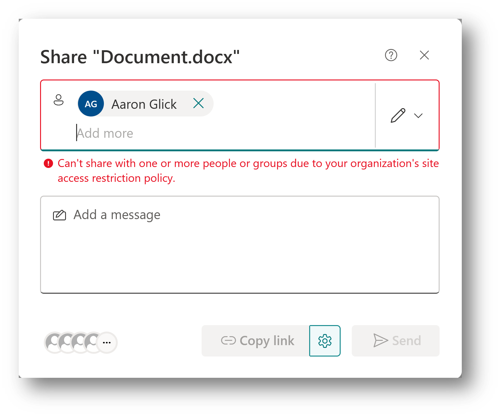
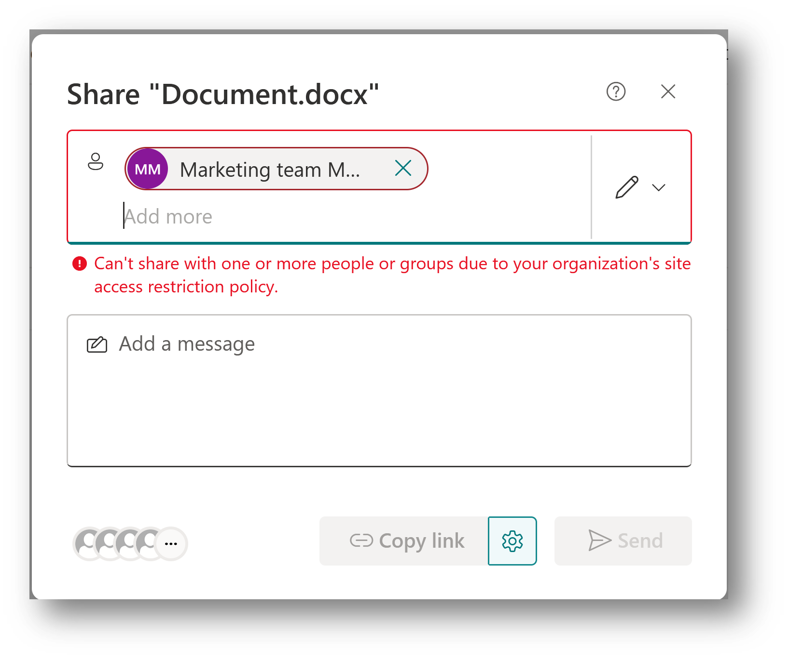
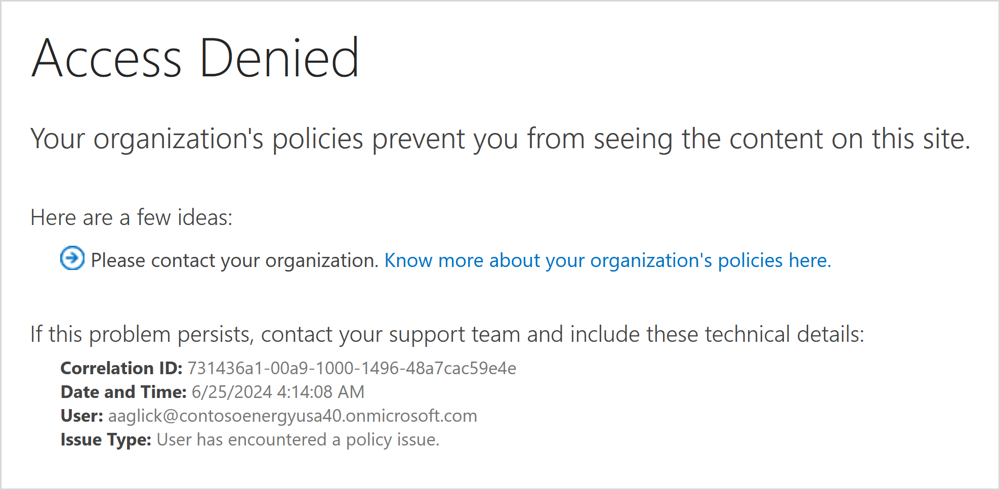

# Restrict access to a user's OneDrive content to people in a group

[!INCLUDE[Advanced Management](includes/advanced-management.md)]

You can restrict access to an individual user's OneDrive content to users in a security group by using a OneDrive access restriction policy. Users not in the specified group can't access the content, even if they had prior permissions or shared link.

The policy is applied using [Microsoft Entra security groups](/azure/active-directory/fundamentals/how-to-manage-groups) that contain the people who should be able to access files in that OneDrive.

When the policy is applied, the people in the security group aren't granted permissions to any files directly. The OneDrive owner must share the content as they normally would. The OneDrive access restriction policy prevents anyone who isn't in the security group from accessing the OneDrive content even if it's shared with them.

Access restriction policies are applied when a user attempts to access a file. Users can still see files in search results if they have direct permissions to the file, but they won't be able to access the file if they're not part of the specified security group.

You can also restrict access to the OneDrive service itself to people in a security group. For more information, see [Restrict OneDrive access by security group](limit-access.md).

## Requirements

The OneDrive access restriction policy requires [Microsoft SharePoint Premium - SharePoint Advanced Management](advanced-management.md).

## Enable site access restriction for your organization

You must enable site access restriction for your organization before you can configure it for a user's OneDrive.

To enable site access restriction for your organization in SharePoint admin center:

1. Expand **Policies** and select **Access control**.
1. Select **Site access restriction**.
1. Select **Allow access restriction** and then select **Save**.

   :::image type="content" source="media/rac-spac/1-rac-spac-dashboard-feb-2024.png" alt-text="screenshot of site access restriction in sharepoint admin center dashboard." lightbox="media/rac-spac/1-rac-spac-dashboard-feb-2024.png":::

To enable site access restriction for your organization using PowerShell, run the following command:

```Powershell
Set-SPOTenant -EnableRestrictedAccessControl $true
```

It might take up to one hour for command to take effect.

> [!NOTE]
> For Microsoft 365 Multi-Geo users, run this command separately for each desired geo-location.

## Restrict access to a user's OneDrive content

Each OneDrive can be assigned up to 10 Microsoft Entra security groups. Once a security group is added, only users in the groups have access to content in that OneDrive that has been shared with them. You can use [dynamic security groups](/azure/active-directory/enterprise-users/groups-create-rule) if you want to base group membership on user properties.

> [!IMPORTANT]
> The owner of the OneDrive must be included in one of the security groups that you specify or they'll lose access to their OneDrive and its contents.

To manage access restriction for OneDrive, use the following commands:

| Action  | PowerShell command |
|---------|---------|
|Enable access restriction for a given OneDrive. (Run this command before adding security groups.) |`Set-SPOSite -Identity <siteurl> -RestrictedAccessControl $true`|
|Add security group |`Set-SPOSite -Identity <siteurl> -AddRestrictedAccessControlGroups <comma separated group GUIDS>`         |
|Edit security group     |`Set-SPOSite -Identity <siteurl> -RestrictedAccessControlGroups <comma separated group GUIDS>`         |
|View security group     |`Get-SPOSite -Identity <siteurl> Select RestrictedAccessControl, RestrictedAccessControlGroups`         |
|Remove security group     |`Set-SPOSite -Identity <siteurl> -RemoveRestrictedAccessControlGroups <comma separated group GUIDS>`         |  
|Reset site access restriction  |`Set-SPOSite -Identity <siteurl> -ClearRestrictedAccessControl`         |

## Sharing of sites with Restricted site access policy

Sharing of SharePoint sites and its content can be blocked with users and groups who aren't allowed as per the Restricted access control policy.

The sharing control functionality is disabled by default. To enable it, run the following PowerShell command in SharePoint Online Management Shell as an Administrator:

```powershell
Set-SPOTenant -AllowSharingOutsideRestrictedAccessControlGroups $false 
```

### Sharing with users

Sharing is only allowed with users who are part of restricted access control groups. Sharing will be blocked with anyone outside of the restricted access control groups as shown below:



### Sharing with groups

Sharing is allowed with Microsoft Entra Security or Microsoft 365 groups which are part of the restricted access control groups list. Thus, sharing with all other groups including Everyone except external users or SharePoint groups won’t be allowed.



> [!NOTE]
> At present, sharing of a site and its content won't be allowed for the nested security groups that are part of the restricted access control groups. This support will be added in the next release iteration.

## Configure learn more link for access denial error page

Configure your learn more link to inform users who were denied access to a SharePoint site due to the restricted site access control policy. With this customizable error link, you can provide more information and guidance to your users.

> [!NOTE]
> The learn more link is a tenant-level setting that applies to all sites that have restricted access control policy enabled.  

To configure the link, run the following command in SharePoint PowerShell:

```powershell
Set-SPOTenant -RestrictedAccessControlForSitesErrorHelpLink “<Learn more URL>” 
```

To fetch the value of the link, run the following command:

```powershell
Get-SPOTenant | select RestrictedAccessControlForSitesErrorHelpLink 
```

The configured learn more link is launched when the user selects the **Know more about your organization’s policies here** link.



## Restricted site access policy insights

As an IT administrator, you can view the following reports to gain more insight about SharePoint sites protected with restricted site access policy:

- Sites protected by restricted site access policy (RACProtectedSites)
- Details of access denials due to restricted site access (ActionsBlockedByPolicy)

> [!NOTE]
> It can take a few hours to generate each report.

### Sites protected by restricted site access policy report

You can run the following commands in SharePoint PowerShell to generate, view, and download the reports:

| Action  | PowerShell command | Description |
|---------|---------|---------|
|Generate report     |`Start-SPORestrictedAccessForSitesInsights -RACProtectedSites`| Generates a list of sites protected by restricted site access policy|
|View report |`Get-SPORestrictedAccessForSitesInsights -RACProtectedSites -ReportId <Report GUID>`| The report shows the top 100 sites with the highest page views that are protected by the policy.|
|Download report   |`Get-SPORestrictedAccessForSitesInsights -RACProtectedSites -ReportId <Report GUID> -Action Download`| This command must be run as an administrator. The downloaded report is located on the path where the command was run.|
|Percentage of site protected with restricted site access report|`Get-SPORestrictedAccessForSitesInsights -RACProtectedSites -ReportId <Report GUID> -InsightsSummary`|This report shows the percentage of sites that are protected by the policy out of the total number of sites|

### Access denials due to restricted site access policy

You can run the following commands to create, fetch, and view report for access denials due to restricted site access reports:

| Action  | PowerShell command | Description |
|---------|---------|---------|
|Create access denials report    |`Start-SPORestrictedAccessForSitesInsights -ActionsBlockedByPolicy`| Creates a new report for fetching access denial details|
|Fetch access denials report status |`Get-SPORestrictedAccessForSitesInsights -ActionsBlockedByPolicy`| Fetches the status of the generated report.|
|Latest access denials in the past 28 days|`Get-SPORestrictedAccessForSitesInsights -ActionsBlockedByPolicy -ReportId <Report ID> -Content AllDenials`| Gets a list of the most recent 100 access denials that occurred in the past 28 days|
|View list of top users who were denied access| `Get-SPORestrictedAccessForSitesInsights -ActionsBlockedByPolicy -ReportId <Report ID> -Content TopUsers`|Gets a list of the top 100 users who received the most access denials|
|View list of top sites that received the most access denials|`Get-SPORestrictedAccessForSitesInsights -ActionsBlockedByPolicy -ReportId <Report ID> -Content TopSites`| Gets a list of the top 100 sites that had the most access denials|
|Distribution of access denials across different types of sites|`Get-SPORestrictedAccessForSitesInsights -ActionsBlockedByPolicy -ReportId <Report ID> -Content SiteDistribution`|Shows the distribution of access denials across different types of sites|

> [!NOTE]
> To view up to 10,000 denials, you must download the reports. Run the download command as an administrator and the downloaded reports are located on the path from where command was run.

## Auditing

Audit events are available in the Microsoft Purview compliance portal to help you monitor site access restriction activities. Audit events are logged for the following activities:

- Applying site access restriction for site
- Removing site access restriction for site
- Changing site access restriction groups for site

## Related articles

[Restrict SharePoint site access to members of a group](restricted-access-control.md)

[Data access governance insights for SharePoint sites](data-access-governance-reports.md)
