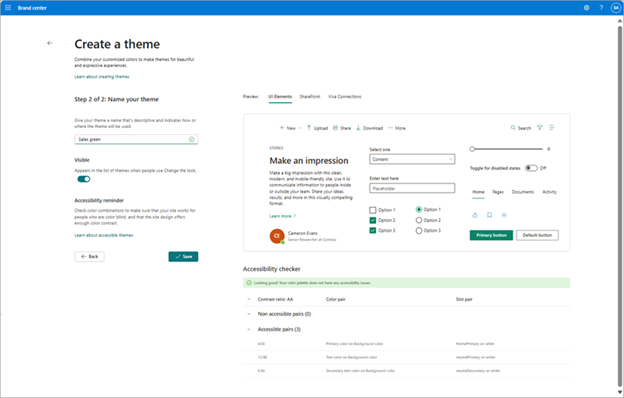

# Site theme
The theme is a powerful tool that allows SharePoint site owners and Viva Connections operators to apply cohesive and visually appealing colors to their web spaces. By leveraging these themes, organizations can create a unified look and feel across their sites, ensuring both aesthetic harmony and brand consistency. The customization options provided by themes enable users to tailor their site designs to reflect their unique brand identities while maintaining functionality and accessibility.

## Principles of SharePoint themes

### Guided

Our theming system works at a global level so that updates can be made consistently across each site, allowing users to optimize their websites effortlessly. 

### Smart and efficient
Our theming system expedites the site creation process by using smart algorithms to generate options that maximize aesthetic choices.

### Professional

Our themes embody a professional look and feel that ensures coherency and conveys the brand of our enterprise audiences

### Accessible

Our built-in accessibility checker ensures universal design at all levels of themes. For users who decide to customize, we provide helpful guidance to design for accessibility. 

## Default themes from Microsoft

* Teal
* Blue
* Orange
* Red
* Purple
* Green
* Periwinkle
* Cobalt

This collection of themes have been designed for accessibility and reflect colors from the Microsoft brand revealing our shared goals and personality. 

## Anatomy of a theme

### Color Combinations

Color combinations are the foundation of your theme, enabling multiple brand colors to reflect your organization’s brand identity and personality. Each theme supports up to 16 color pairs, with each pair consisting of an accent color and a background color. To ensure readability, the text color is automatically set to black or white based on the contrast ratio of the background color.

### Application Zones
Theme colors are applied across key areas of the SharePoint site:

* Site Header and Footer: Managed by site owners to establish consistent branding.
* Section Design: Page authors can apply color combinations to individual sections for visual distinction.
* Text Web Part (Rich Text Editor): Theme colors enhance text formatting and styling.
* Design Ideas: Color combinations are reflected in suggested layouts and visual enhancements.

## Create your own theme

In the SharePoint brand center, a brand manager can create custom themes for your organization. These themes are available in the Change the Look experience for site owners and Viva Connections operators to apply to their sites and experiences.

> [!NOTE] 
> To create custom themes in the Brand center, your administrator must have enabled the Brand center from the Microsoft 365 Admin center.
> You can only read or delete a legacy custom theme which consists of primary color, text color, background color, accent color. The legacy custom theme won't be automatically upgrade to the new custom theme format.

Visit the SharePoint or Viva Connections branding experiences and select **New theme**.
* **Step 1**: Select your primary, secondary colors using your brand colors or by adding a custom color. Add up to 16 combinations within the primary and secondary colors. In each color combination, you can switch around the background/accent color.
* **Step 2**: Name your theme and preview in SharePoint experiences.

 
## Pay attention to accessibility
Color and contrast are important for accessibility. People with low vision, such as those with macular degeneration, need a certain amount of contrast to be able to see what’s on the screen. It’s also important to be careful with color selection, because color blind people can’t tell the differences between certain colors. For example, someone who has red-green color-blindness sees red and green as the same color.
In this theme creation experience we provide a color contrast checker built into the UI Elements preview to guide you towards creating accessible themes. 

## See also
[SharePoint site theming](/sharepoint/dev/declarative-customization/site-theming/sharepoint-site-theming-overview)
