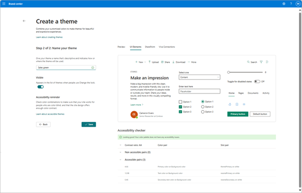

# Site theme
The theme is a powerful tool that allows SharePoint site owners and Viva Connections operators to apply cohesive and visually appealing colors to their web spaces. By leveraging these themes, organizations can create a unified look and feel across their sites, ensuring both aesthetic harmony and brand consistency. The customization options provided by themes enable users to tailor their site designs to reflect their unique brand identities while maintaining functionality and accessibility.

## Principles of SharePoint themes

### Guided

Our theming system works at a global level so that updates can be made consistently across each site, allowing users to optimize their websites effortlessly. 
Smart and efficient
Our theming system expedites the site creation process by using smart algorithms to generate options that maximize aesthetic choices.

### Professional

Our themes embody a professional look and feel that ensures coherency and conveys the brand of our enterprise audiences

### Accessible

Our built-in accessibility checker ensures universal design at all levels of themes. For users who decide to customize, we provide helpful guidance to design for accessibility. 

## Default themes from Microsoft

* Teal
* Blue
* Orange
* Red
* Purple
* Green
* Gray
* Periwinkle
* Black
* Cerulean
* Cobalt
* Dark Yellow
* Dark Blue

This collection of themes have been designed for accessibility and reflect colors from the Microsoft brand revealing our shared goals and personality. 

## Anatomy of a theme

### Primary color

This color is central to your brand identity and personality. Consider how it makes your audience feel and how it differentiates your brand from competitors. 

### Text color

The text color defines the default color experience for the majority of your text in your experiences. Consider how it will be used and if it can be easily read against the background color. 

### Background color

This color is used behind your text and images to display all the content in your sites and pages. 

### Accent color

This color is used sparingly to complement your brand and enhance your experiences. 

### Dark theme

The dark theme setting is used to update the behavior of your colors when used on a dark background color. This will automatically adjust text and other content for accessibility when your theme is dark. 

## Create your own theme

In the SharePoint brand center, a brand manager can create custom themes for your organization. These themes are available in the Change the Look experience for site owners and Viva Connections operators to apply to their sites and experiences.

> [!NOTE] 
> To create custom themes in the Brand center, your administrator must have enabled the Brand center from the Microsoft 365 Admin center.

Visit the SharePoint or Viva Connections branding experiences and select **New theme**.
**Step 1**: Select your primary, text, background, and accent colors using your brand colors or by adding a custom color.  Update the dark theme setting to reflect your background color selection. 
**Step 2**: Name your theme and preview in different experiences. Determine the Visible setting for your font package.

 
## Pay attention to accessibility
Color and contrast are important for accessibility. People with low vision, such as those with macular degeneration, need a certain amount of contrast to be able to see what’s on the screen. It’s also important to be careful with color selection, because color blind people can’t tell the differences between certain colors. For example, someone who has red-green color-blindness sees red and green as the same color.
In this theme creation experience we provide a color contrast checker built into the UI Elements preview to guide you towards creating accessible themes. 

## See also
[SharePoint site theming](/sharepoint/dev/declarative-customization/site-theming/sharepoint-site-theming-overview)
